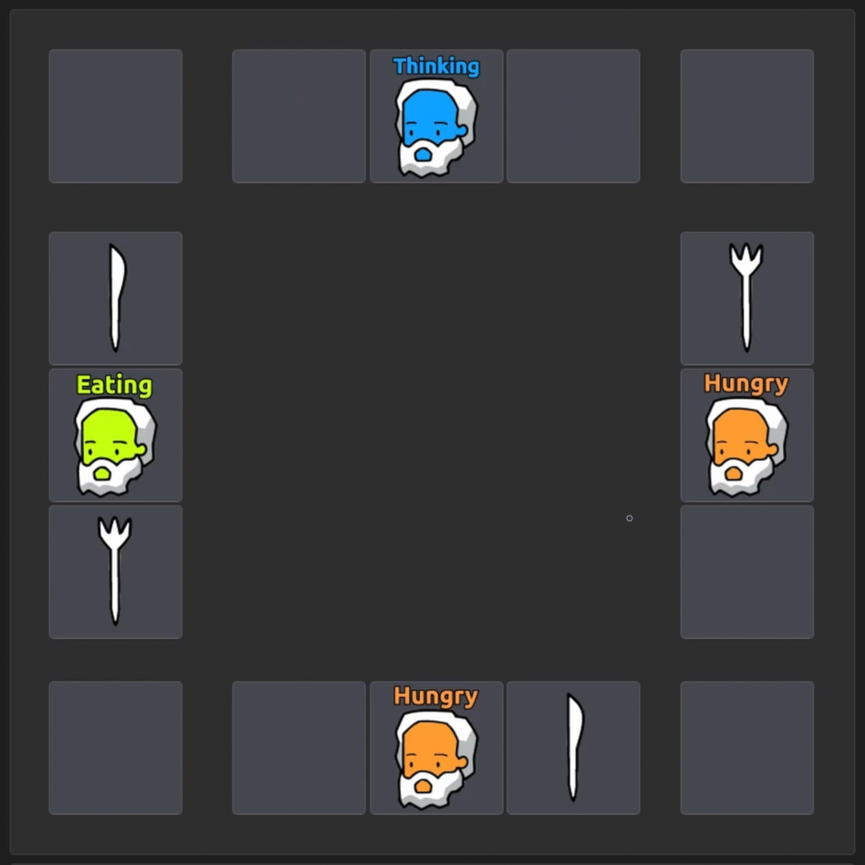

The objective of this ongoing project is to develop a series of programs demonstrating various multithreading techniques and synchronization strategies using C++ and the QT framework.

## 1) Dining Philosophers Problem

Two algorithms were implemented:
- Hold and wait, that demonstrates how deadlocks can occur when resources are held while waiting for others.
- Chandy/Misra algorithm, that prevents deadlocks by prioritizing resource allocation and managing ownership efficiently.

